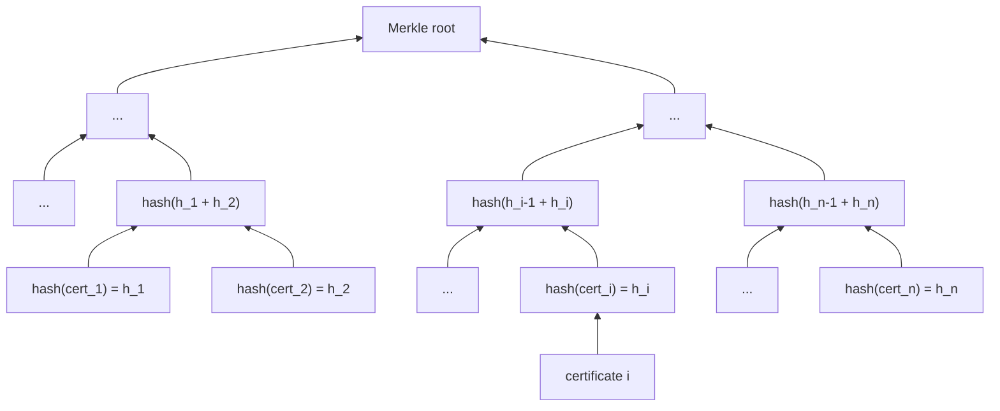

```mermaid
flowchart BT;
    A["hash(cert_1) = h_1"] --> AB["hash(h_1 + h_2)"]
    B["hash(cert_2) = h_2"] --> AB

    C[...] --> CD["hash(h_i-1 + h_i)"]
    cert[certificate i] --> D
    D["hash(cert_i) = h_i"] --> CD

    E[...] --> EF["hash(h_n-1 + h_n)"]
    F["hash(cert_n) = h_n"] --> EF

    _AB[...] --> __AB[...]
    AB --> __AB

    CD --> CDEF[...]
    EF --> CDEF

    __AB --> ROOT[Merkle root]
    CDEF --> ROOT

```