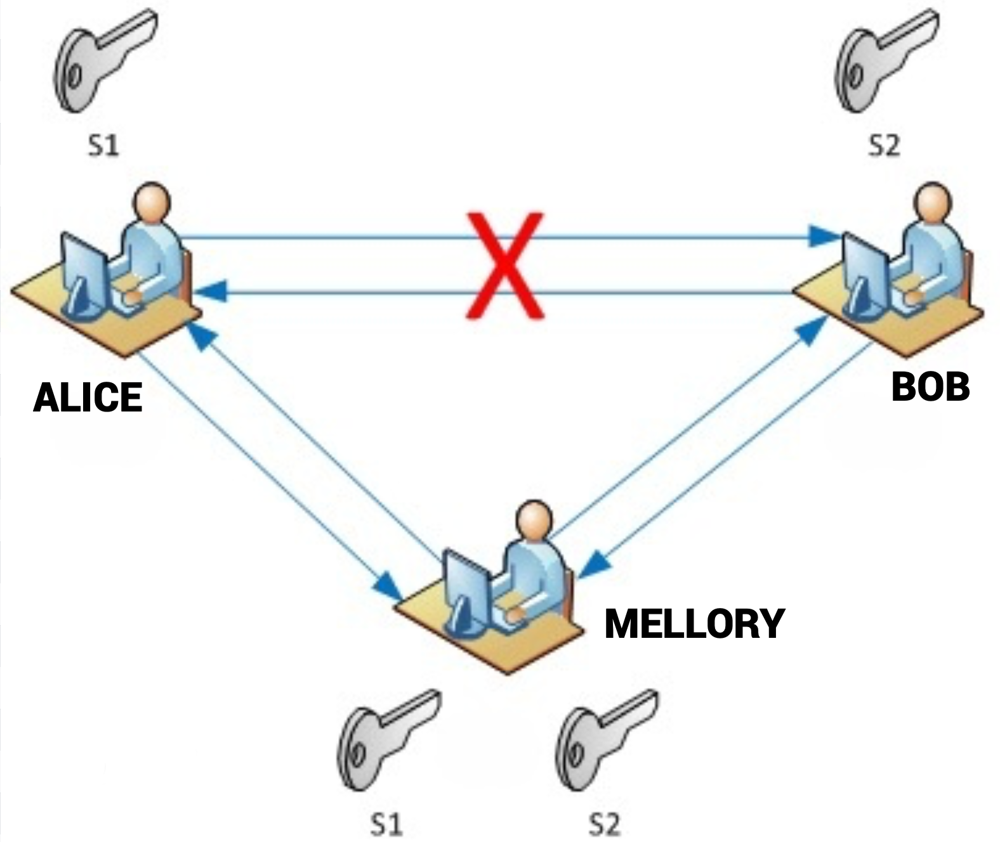
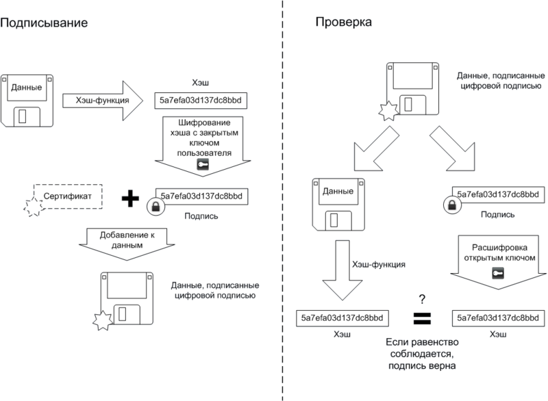
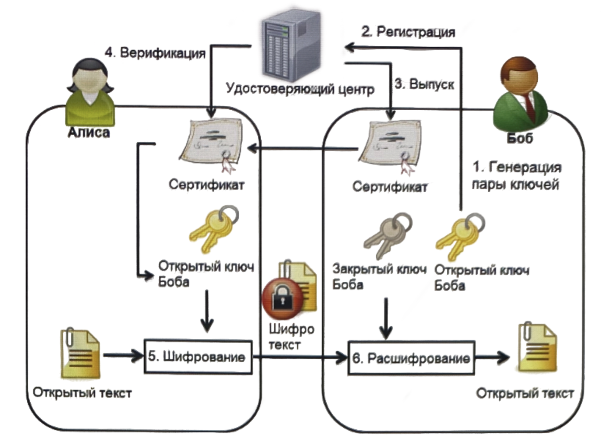
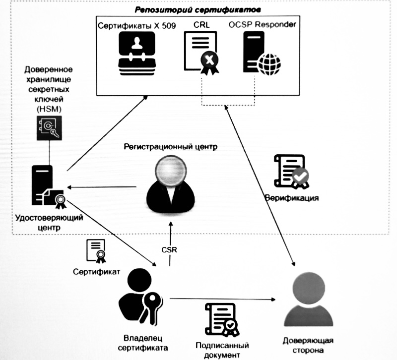
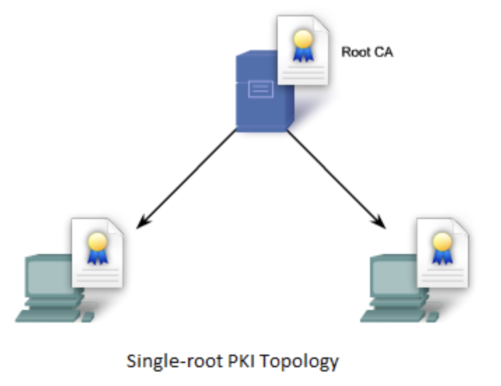
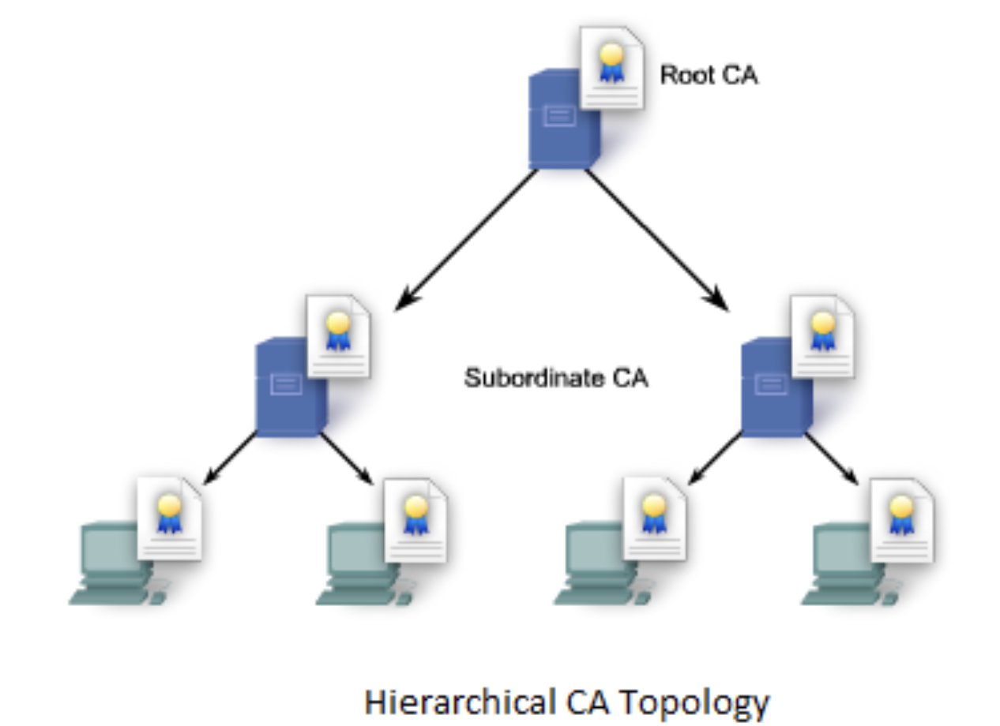
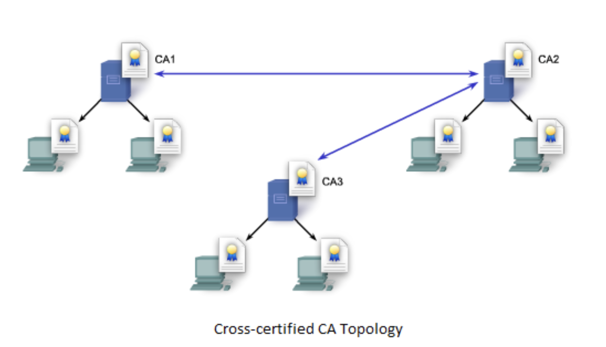

# Введение

На сегодняшний день инфраструктура открытых ключей (Public Key Infrastructure - PKI) является одной из наиболее важных и эффективных систем, обеспечивающих аутентификацию, целостность данных (с помощью электронной подписи) и построение защищенных каналов передачи данных. РКІ касается практически каждого. И для того, чтобы на практике правильно работать с данной инфраструктурой, необходимо разобраться в теоретических основах.

## Симметричная и асимметричная криптография

Рассмотрим пару человек. Традиционно их называют Алисой и Бобом. Предположим, Алиса хочет связаться с Бобом. Тем временем злоумышленник Мэллори хочет подслушать и, возможно, доставить ложное сообщение Бобу. Единственным способом, которым они могут это сделать, является обмен сообщениями через открытый канал передачи данных.

Так как канал открытый, то передаваемые сообщения могут быть подслушаны или изменены злоумышленником. Данный вид воздействия злоумышленника на сообщение называется атакой «человек посередине» (Man-in-the-Middle - MITM). Один из способов защиты от MITM - применение шифрования к сообщениям.

При использовании симметричных алгоритмов шифрования один и тот же ключ используется как для шифрования, так и для расшифрования данных. Использовать открытые каналы связи для передачи ключа небезопасно. Такая проблема называется задачей распределения ключа. Основная проблема подхода заключается в сложности передачи секретного ключа получателю. Как Алисе и Бобу безопасно обменяться этим ключом, чтобы его не перехватила Мэллори? Данную задачу решает криптография с открытым ключом. В данном случае шифрование осуществляется парой ключей: открытым и закрытым. Алиса и Боб генерируют каждый свой закрытый (приватный) ключ и по определенному алгоритму вычисляют другой - открытый (публичный) ключ. Затем они обмениваются своими открытыми ключами по открытому каналу связи. Закрытые же ключи хранятся в секрете.

Для отправки сообщения от Алисы к Бобу необходимо Алисе зашифровать его открытым ключом Боба. Боб, когда получит зашифрованное сообщение, расшифрует его своим закрытым ключом. Следует отметить, что открытым ключом можно только зашифровать сообщение, но расшифровать его этим же ключом уже не получится. Для расшифрования нужен только закрытый ключ из пары. 

В данном способе все еще сохраняется проблема обмена ключами, но теперь открытыми. Когда Боб отправляет свой ключ, его может перехватить Мэллори. Мэллори генерирует новую пару ключей и отправляет свой открытый ключ Алисе, утверждая, что это ключ Боба.

Теперь, если Алиса захочет отправить сообщение Бобу, она зашифрует его открытым ключом Мэллори, думая, что ключ принадлежит Бобу. Мэллори перехватит данное зашифрованное сообщение. Так как оно зашифровано ее открытым ключом, то она легко расшифрует своим закрытым ключом. Затем Мэллори может прочитать или изменить сообщение и отправить его, зашифровав настоящим открытым ключом Боба. Боб расшифрует полученное письмо своим закрытым ключом и будет уверен, что именно такое сообщение отправила ему Алиса. И все дальнейшее общение будет проходить через человека посередине. А Алиса и Боб будут уверены, что общаются исключительно друг с другом.

## Концепция доверия

Сегодня электронное общение стали обычным делом для миллионов людей - появляются возможности совершать покупки в интернет-магазинах, заключать электронные договоры, участвовать в электронном голосовании - значение доверия в сфере электронных коммуникаций неуклонно возрастает.

Очевидно, что невозможно избежать проблем безопасности в сфере электронных коммуникаций, но, в дополнение к технологиям защиты, можно выработать решение, способное уменьшить риск. Это решение также известно как доверие. Чем больше риск ущерба или потери значительных ресурсов, тем выше требования к доверию. При этом большая неопределенность в возможности проверить операцию или результат, отсутствие предсказуемости в ожидаемом качестве и уровне безопасности также влияют на уровень доверия.

Задача Алисы: убедиться, что на другой стороне связи находится именно Боб. Если бы у Алисы и Боба был общий знакомый, которому они оба доверяют, то он мог бы поручиться за каждого из них перед другим.

В глобальной сети, объединяющей сотни тысяч или миллионов субъектов, наиболее практичным способом является организация доверенных центров, которым большая часть сообщества доверяет связывания открытых ключей и идентификационных данных их владельцев. Такие доверенные центры в терминологии РКІ называются удостоверяющими центрами (УЦ, англ. Certificate Authority - CA). Они заверяют электронной подписью структуру данных, которая содержит некоторые идентификационные данные и соответствующий им открытый ключ.

Эта структура данных называется сертификатом открытого ключа (или просто сертификатом). По своей сути, сертификат представляет собой некое зарегистрированное удостоверение, которое хранится в электронном формате и признается сообществом пользователей РКІ законным и надежным. Для заверения электронного сертификата используется электронная подпись УЦ - в этом контексте удостоверяющий центр аналогичен нотариальной конторе, так как подтверждает подлинность сторон, участвующих в обмене электронными сообщениями или документами.

## Электронная подпись (ЭП)

Электронную подпись должно быть очень трудно подделать, иначе Мэллори всё же сможет подсунуть Алисе свой ключ вместо ключа Боба. А также подпись должна быть короткой, так как передавать большой файл, отягощенный еще и большой подписью, очень накладно.

Как же создать такую подпись? Любую информацию можно представить в виде последовательности бит (нулей и единиц). Для этого сначала вычисляется хэш. На вход некоторой функции (называемой функцией хэширования или хэш-функцией) передается последовательность бит подписываемого файла, и возвращается другая последовательность бит фиксированной (заранее известной) длины. Эта выходная последовательность и называется хэшем (хэш-значением).

Функции хэширования обладают следующими свойствами:

- для входной последовательности любой длины они всегда генерируют хэш одной и той же длины, причем эта длина зависит от используемой хэш-функции. Обычно эта длина не превышает нескольких десятков байт;
- восстановить из хэша исходную последовательность бит практически невозможно;
- трудно подобрать две последовательности бит, дающих один и тот же хеш.

Хэш может посчитать любой человек. Поэтому здесь на помощь снова приходит шифрование с открытым ключом. Хэш файла шифруется с помощью закрытого ключа. Полученная подпись вместе с сертификатом добавляется к файлу и затем всё отправляется получателю.

Для проверки подписи получатель с помощью открытого ключа отправителя расшифровывает электронную подпись и сравнивает полученный хэш с самостоятельно вычисленным хэшем файла. Если хэши сходятся, то можно быть уверенным, что электронная подпись является подлинной и никаких изменений в исходное сообщение не вносилось.

Чтобы Алиса могла убедиться, что отправляет сообщения именно Бобу и только он сможет их прочитать, ими выполняются следующие действия:
1. Боб генерирует пару ключей (открытый и закрытый);
2. Боб отправляет свой открытый ключ УЦ и свой идентификатор;
3. УЦ, убедившись, что Боб — это действительно Боб, выпускает подписанный сертификат открытого ключа и отправляет его Бобу;
4. Затем Боб отравляет свой сертификат Алисе, а она проверяет его подлинность через УЦ;
5. Алиса шифрует файл (сообщение) с помощью открытого ключа из сертификата Боба и отправляет ему;
6. Боб расшифровывает полученное сообщение с помощью своего
закрытого ключа. 

На 4 шаге Алиса проверяет сертификат Боба и одним из этапов проверки является проверка подписи выдавшего сертификат УД с помощью открытого ключа этого УЦ. А каким образом Алиса получает открытый ключ УЦ? Открытый ключ УЦ распространяется так же с помощью сертификата, но теперь уже подписанного вышестоящим УЦ. А как же распространяется открытый ключ этого вышестоящего УЦ? Ну конечно же тоже сертификатом. Такая цепочка сертификатов называется цепочкой доверия. Обычно она заканчивается корневым сертификатом (Root Certificate). Этот сертификат подписан сам собой и зовется самоподписанным (self-signed certificate).

Обычно корневые сертификаты принадлежат очень надёжным компаниям. Почему же мы доверяем корневым сертификатам? Дело в том, что основные корневые сертификаты не распространяются по открытому каналу, а устанавливаются вместе с операционной системой и другим прикладным ПО. Так, некоторые браузеры также устанавливаются со своим набором доверенных сертификатов.

## Основные компоненты и архитектуры PKI

### Основные компоненты PKI

Нельзя утверждать, что РКІ сама по себе является инфраструктурой безопасности, но она может быть основой всеобъемлющей инфраструктуры безопасности. Цель РКІ состоит в управлении ключами и сертификатами, посредством которого компания может поддерживать надежную сетевую среду. РКІ позволяет использовать сервисы шифрования и выработки электронной подписи согласованно с широким кругом приложений, функционирующих в среде открытых ключей.

#### Удостоверяющие центры

Удостоверяющий центр является главным управляющим компонентом РКІ. УЦ генерирует собственную пару ключей и отправляет запрос на выпуск сертификата (CSR - Certificate Signing Request) вышестоящему УЦ. Если он сам является корневым, то выпускает самоподписанный сертификат, как это и было сказано ранее.

Основными функциями УЦ являются: выпуск, обновление и отзыв сертификатов.

Удостоверяющий центр выпускает сертификаты подчиненным УЦ, конечным пользователям или кросс-сертификаты для сторонних УЦ, например, УЦ других компаний. В электронном мире УЦ принято доверять, только если оба пользователя, которые пытаются общаться между собой, обслуживаются в этом УЦ. В случае если УЦ у каждого пользователя свой, встает проблема доверия между УЦ. Один из путей решения - кросс-сертификация между УЦ разных пользователей.

Так как каждый сертификат имеет свой срок жизни, то их необходимо периодически обновлять, выпуская новый сертификат. Устаревшие сертификаты можно определить по указанному в них сроку действия. Однако случаются ситуации, в которых необходимо отозвать сертификат до наступления этого срока (например, если закрытый ключ был скомпрометирован, владелец сертификата был уволен и т.д.). Когда такое происходит, УЦ включает серийный номер этого сертификата в список отозванных сертификатов (CRL — Certificate Revocation List).

Компонентом УЦ является доверенное хранилище секретных ключей - это надежный контрагент, в котором реализовано хранение ключей. Одним из способов организации такого хранилища является HSM (Hardware Security Module) - аппаратное решение для хранения закрытых ключей.

Хранилище ключей является очень надежным, поэтому компрометация закрытого ключа УЦ очень маловероятное событие. Таким образом, УЦ является стороной, вызывающее большое доверие. Необходимо отметить, что УЦ не хранит закрытые ключи пользователей.

#### Регистрационный реестр

Регистрационный центр (РЦ, англ. Registration Authority - RA) является необязательным компонентом PКІ. В некоторых случаях его роль выполняет УЦ.

РЦ регистрирует пользователей, осуществляет проверку
идентификационной информации, заносимой в сертификат.
РЦ выступает как доверенный объект УЦ. Получая подписанные им документы, УЦ полностью полагается на надежность предоставленной информации от РЦ и выпускает сертификат, не перепроверяя полученные данные. При этом необходимо заметить, что один РЦ может работать с несколькими УЦ, так же как и один УЦ может работать с несколькими РЦ. В функции регистрационного центра также могут входить генерация ключей, уведомление об аннулировании сертификатов и др. Однако он не может выпускать сертификаты и CRL.

#### Репозиторий сертификатов

Репозиторий сертификатов является хранилищем выпущенных сертификатов и списков отозванных сертификатов, предоставляет информацию о статусе сертификатов. При этом важно заметить, что в репозиторни не хранятся закрытые ключи пользователей. CRL представляет собой список сертификатов, которые УЦ пометил как отозванные, при этом сертификаты с истекшим сроком действия не вносятся в этот список. CRL применяются для установления действительности сертификата. Если сертификат присутствует в CRL, то считается недействительным.

Проверка сертификатов по спискам отзыва является неотъемлемой частью проверки сертификата на актуальность и возлагается на проверяющую сторону. 

УЦ публикует такие списки с определенной периодичностью. Проверяющая сторона скачивает последний актуальный CRL. Путь к точке распространения данного списка указывается в расширениях сертификата. При этом точка распространения должна быть общедоступным открытым ресурсом, не требующим аутентификации. В противном случае потребитель не сможет осуществить проверку действительности сертификата.

Так как сертификатов может быть много, то CRL со временем становится объемным, поэтому УЦ выпускают и дельта CRL, в который включаются только сертификаты, отозванные с момента последней публикации полного списка. Дельта CRL выпускаются чаще, содержат более актуальную информацию и, соответственно, меньше весят.

Тем не менее, CRL в некоторых случаях оказывается ненадежным в качестве механизма распространения статуса сертификата. Критические приложения требуют немедленного отзыва сертификатов, однако CRL выпускается недостаточно часто. Увеличение же частоты выпуска CRL увеличивает нагрузку на сервер, а также на клиента, который получает CRL.

Альтернативой является OCSP — Online Certificate Status Protocol. Данное решение предоставляет ответ сервера (OCSP-респондер) о конкретном запрашиваемом сертификате в режиме реального времени. Сервер создает свежий CRL с одиночной записью в ответ на запрос о статусе сертификата. Однако нагрузка на поиск сертификата и создания ответа для каждого запроса ложится на сервер. Кроме того, повышается нагрузка на сетевую инфраструктуру. Очевидно, что OCSP требует наличие сетевого подключения к респондеру.

Важно заметить, что OCSP доступен только по прикладному протоколу НТТР, так как установление защищенного HTTPS соединения возможно только после проверки статуса сертификата, которая, в свою очередь, осуществляется через OCSP.

Важно понимать, что CRL и OCSP отвечают на вопрос «Аннулирован ли сертификат?», а не «Действителен ли сертификат в настоящее время?». Ниже приведена таблица сравнения OCSP и CRL.

|     | OCSP | CRL |
| --- | ---- | --- |
| Актуальность ответа	| В режиме реального времени (при работе по БД)/соответствует CRL (при работе по CRL) | Максимальная задержка равна периоду публикации CRL (от нескольких часов до нескольких месяцев) |
| Сетевое подключение | Онлайн-протокол | Скачиваемый файл |
| Объем пересылаемой клиенту информации	| OCSP-ответ имеет фиксированный и сравнительно малый объем | Клиенту требуется загрузить CRL, который может иметь большой объем |

OCSP и CRL не являются конкурирующими решениями. Это
взаимодополняемые способы предоставления актуальных списков отозванных сертификатов.

#### Конечные объекты

В системе РКІ конечный объект является общим термином для определения субъекта, который использует некоторые службы или функции системы РКІ. Это могут быть владельцы сертификатов и доверяющие стороны. Конечным объектом может быть физическое или юридическое лицо, приложение, сервер и т.д. 

Владелец сертификата направляет CSR регистрационному центру. В случае успешной проверки УЦ выпускает сертификат пользователя.

Доверяющие стороны запрашивают и полагаются на информацию о статусе сертификатов из CRL или OCSP и о сертификатах открытых ключей их владельцев.

На конечного пользователя возлагается ответственность за хранение закрытого ключа в секрете. Никто, кроме владельца, не должен иметь доступ к закрытому ключу.

### Доверие PKI

Фундаментом доверия РКІ являются надежные сертификаты открытых ключей. Надежность сертификатов открытых ключей зависит от надежности УЦ, которые их подписывают. Это допущение формирует отношения доверия между различными сторонами - учасниками системы РКІ и позволяет конечным субъектам считать свои транзакции надежными.

Отношения между взаимодействующими УЦ формируют один или несколько путей сертификации, в результате верификации которых принимается решение о доверии к сертификату участника системы PKI.

При развертывании РКІ сложной структуры организация должна определить, будет ли она доверять сертификатам пользователей и приложений только своего домена доверия или других доменов тоже. Домен доверия, или домен политик, характеризуется набором политик, в соответствии с которыми выпускает сертификаты данный УЦ. Если принимается решение о доверии ограниченному набору доменов, то должны быть выпущены кросс-сертификаты и тем самым внедрена в другие домены модель доверия данной организации.

Модель доверия важна для определения отношений не только с внешними сторонами, но и между учасниками РКІ внутри организации. Так, некоторым организациям свойственна сложная корпоративная иерархия, поэтому в составе их РКІ могут быть один головной УЦ и множество подчиненных ему УЦ отделов и подразделений, то есть модель доверия будет базироваться на традиционных для конкретной компании правилах ведения бизнеса и отношениях между подразделениями. В других случаях модель доверия РКІ организации может строиться на основе подписанных соглашений о политике применения сертификатов и ответственности УЦ, связанных отношениями доверия, - тогда должны быть рассмотрены вопросы о степени ответственности организации и пользователей сертификатов в условиях кросс-сертификации.

### Архитектура PKI

Архитектура РКІ описывает структуру отношений доверия между УЦ и другими субъектами инфраструктуры. Выделяют следующие основные типы архитектур РКІ:
1. простая РКІ (одиночный УЦ);
2. иерархическая РК;
3. кросс-сертифицированные корпоративные PKI.

#### Простая PKI

В конфигурации простой РКІ только один корневой УЦ (Root CA) выпускает все сертификаты и списки отозванных сертификатов, и все пользователи ему доверяют. Самый большой недостаток РКІ с одиночным УЦ заключается в том, что компрометация УЦ делает недействительными все выпущенные им сертификаты. Каждый пользователь такой РКІ должен быть немедленно информирован о компрометации, в противном случае пользователи, доверяющие ненадежному УЦ, будут подвергаться риску. Для того чтобы восстановить работу УЦ, необходимо повторно выпустить все сертификаты и распространить новый сертификат УЦ среди всех пользователей.

#### Иерархическая PKI

В иерархической РКІ все пользователи доверяют одному и тому же центральному корневому УЦ. Все удостоверяющие центры, за исключением корневого, подчиняются одному вышестоящему УЦ. Это топология является самой распространенной.

У такой топологии имеются следующие преимущества:
- для добавления нового УД в инфраструктуру одному из существующих УЦ достаточно выпустить для него сертификат;
- в иерархии легко строить пути сертификации, так как каждый УЦ подчиняется только одному вышестоящему УЦ;
- при компрометации закрытого ключа подписи одного из выпускающих УЦ вышестоящий УЦ просто аннулирует его сертификат. 

Ущерб от выхода из строя конкретного УД зависит от того, на каком уровне иерархии он находится. Чем ближе УЦ к верху ерархии, тем более разрушительны для всей РКІ последствия его выхода из строя. Для восстановления работы скомпрометированного УЦ вышестоящий УЦ выпускает для него новый сертификат с новым открытым ключом. Как только работа УЦ восстанавливается, он выпускает новые сертификаты для всех своих пользователей.

Очевидно, что для защиты более высоких уровней иерархии, особенно корневого УЦ, необходимы дополнительные меры безопасности, например использование ключа подписи большей длины и/или хранение материала секретных ключей при помощи аппаратного модуля.

#### Кросс-сертифицированные корпоративные РКІ

Кросс-сертификат - это сертификат, издателем и субъектом которого являются разные УЦ.

Если оба УЦ принадлежат одному домену, то их связь называется внутридоменной кросс-сертификацией. Например, в иерархической структуре корневой УЦ выдает сертификат подчиненному УЦ.

Если оба УЦ принадлежат разным доменам, то такая связь называется междоменной кросс-сертификацией. Такая связь может быть установлена, как только в одном направлении, так и в обе стороны с взаимной сертификацией.

При односторонней кросс-сертификации только один УЦ выпускает кросс-сертификат для другого и начинает доверять его сертификатам.

При двусторонней - оба УЦ выпускают друг для друга кросс-
сертификаты.

# Литература
- ИНФОРМАЦИОННАЯ БЕЗОПАСНОСТЬ
ПРАКТИКА ИНФОРМАЦИОННОЙ БЕЗОПАСНОСТ http://dorlov.blogspot.com/2010/09/issp-06-4.html
- Первый ОФД Принцип работы ЭЦП https://www.1-ofd.ru/blog/news/princip-raboty-ecp/
- What is a Public Key Infrastructure (PKI)? https://www.essendi.ch/en/what_is_a_pki/
- Архитектура PKI https://docs.google.com/presentation/d/1GqfF1bJ2gEFJ5TTDtJ9vIV24-9dKTY0nDcabEiwXKNQ/htmlpresent
- SC Labs | Networking notes http://sclabs.blogspot.com/2012/10/ccna-security-chapter-7-cryptographic.html
- LINUX.ORG.RU Проблема доверия центрам сертификации https://www.linux.org.ru/forum/security/9591765