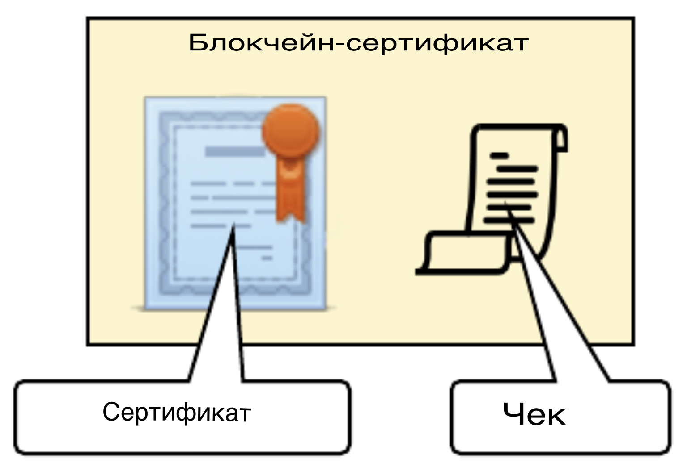

# Выдача блокчейн-сертификатов путем создания транзакции в блокчейне Bitcoin ~~или Ethereum~~

## Задачи:

## Цели:

## Проблема сертификатов TLS в интернете:
Вариант формулировки 1
> Главная проблема с перехватом TLS при помощи MitM в том, что такое решение полностью уничтожает смысл аутентификации узлов на стороне клиента. Дело в том, что клиент больше не может проверять валидность сертификатов оконечного узла, с которым пытается установить соединение: клиент просто не видит этого подлинного узла и сертификатов – он обменивается данными с перехватывающим, подменным узлом и вынужден доверять ему. Если на пути от подменного узла до узла, соединение с которым перехватывается, что-то пошло не так, то обнаружить это “не так” должен перехватывающий узел. Однако, он может этого не делать: вообще, ситуация, когда перехватывающий узел просто не валидирует сертификаты перехватываемого – встречается нередко. Более того, не в интересах перехватывающего прокси заниматься такими проверками. Так, этот узел не может видеть всего контекста установления соединения (часть контекста – у клиента: например, только клиент знает, какие ключи и сертификаты он ожидает получить от сервера), а поэтому в принципе не может надёжно проверить подлинность соединения.

Вариант формулировки 2
> использование подписанных сертификатов даже крупными центрами сертификации далеко не исключает возможность атаки MitM. Корень проблемы в том, что при использовании SSL/TLS браузер (и не только) безпрекословно доверяет подписанным сертификатам. Для того, чтобы он доверял, нужно наличие отпечатка сертификата конкретного центра сертификации в браузере или в ОС в качестве корневого. Все сертификаты, подписанные им, автоматически становятся доверенными и валидными (если всё верно с временем действия, именем домена и некоторыми другими, менее существенными параметрами) для пользователя. Т.е., если центр сертификации подпишет подставной сертификат на какой-то конкретный домен (т.е., выпустит с технической точки зрения легитимный сертификат), то его можно будет подсунуть пользователю и совершить атаку MitM. Обнаружить её можно только сверив отпечатки сертификатов, которые внезапно изменились. Но так же может быть и внезапное плановое обновление, запланированное самой компанией (сайтом/сервисом).

[Проблема доверия центрам сертификации и вариант её решения](https://www.linux.org.ru/forum/security/9591765)

## Для реализации используется:
- спецификация проверяемых учетных данных (W3C Verifiable Credentials specification)
- документы подписываются с помощью подписи MerkleProof2019 LD signature
- использование DIDS (децентрализованных идентификаторов) также возможно для обеспечения большего криптографического подтверждения принадлежности адреса выдачи

[W3C Verifiable Credentials specification](https://www.w3.org/TR/vc-data-model/)
[MerkleProof2019 LD signature](https://w3c-ccg.github.io/lds-merkle-proof-2019/)
[DIDs (Decentralized Identifiers)](https://www.w3.org/TR/did-core/)

## Как работает пакетная выдача

Хотя можно выдать один сертификат с помощью одной биткойн-транзакции, гораздо эффективнее использовать одну биткойн-транзакцию для выдачи пакета сертификатов.

Эмитент создает дерево Merkle из хэшей сертификатов и регистрирует корень Merkle в качестве поля OP_RETURN в транзакции Bitcoin.

Предположим, что пакет содержит $n$ сертификатов, а сертификат $i$ содержит информацию о получателе $i$. Эмитент хэширует каждый сертификат и объединяет их в дерево Merkle:

Корень дерева Меркла, представляющий собой 256-битный хэш, выдается в блокчейне Биткоина.

Блокчейн-сертификат, выданный получателю $i$, содержит подтверждение в формате **Merkle Proof Signature Suite 2019** года, подтверждающее, что сертификат $i$ содержится в дереве Merkle.

Эта квитанция содержит:

- Идентификатор транзакции Bitcoin, хранящий корень Merkle
- Ожидаемый корень Merkle в блокчейне
- Ожидаемый хэш для сертификата получателя $i$
- Путь Merkle от сертификата получателя $i$ к корню Merkle. $h_i -> ... -> Merkle root$

Процесс подтвержедения (верификации):

- Хэш сертификата $i$ соответствует значению в квитанции
- Путь Merkle действителен
- Корень Merkle, хранящийся в блокчейне, соответствует значению в квитанции

Эти шаги устанавливают, что сертификат не был подделан с момента его выдачи.

## Что должно быть в пакете?

Способ определения пакета может варьироваться, но он должен быть определен таким образом, чтобы он менялся нечасто. Например, "выпуски 2024 года" были бы предпочтительнее, чем "выпуски БФУ" (последний должен обновляться каждый год).

Для каждой партии сертификатов выполняется одна транзакция в биткоинах. Количество сертификатов, которые могут быть включены в пакет, не ограничено, поэтому обычно пакеты определяются в логических группах, таких как "Выпускники по специальности Компьютерная безопасность 2024".

## Структура транзакции

[Bitcoin in a nutshell — Transaction](https://habr.com/ru/articles/319860/)
[Opcodes used in Bitcoin Script](https://wiki.bitcoinsv.io/index.php/Opcodes_used_in_Bitcoin_Script)